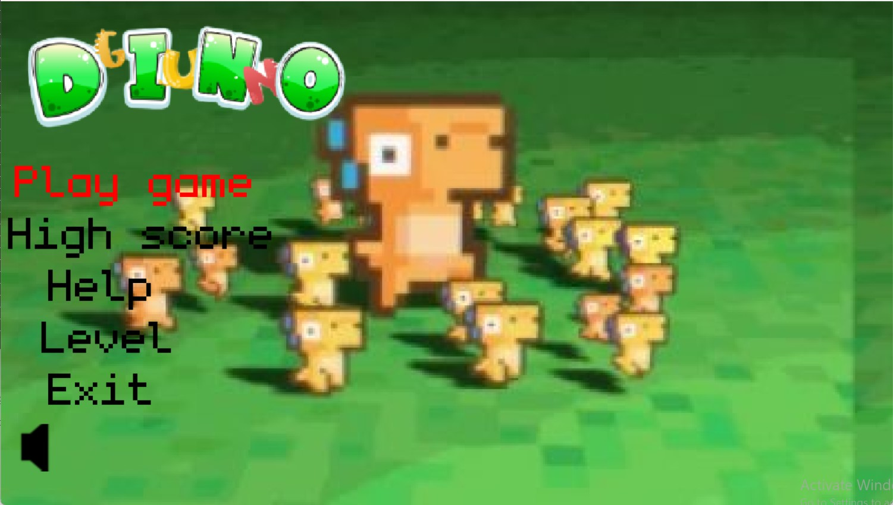
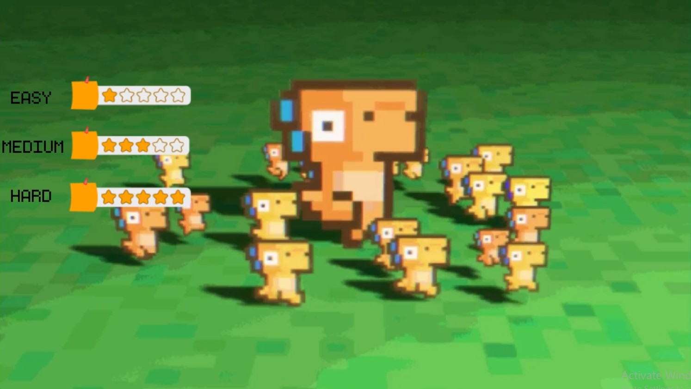
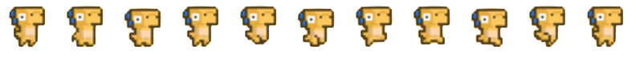
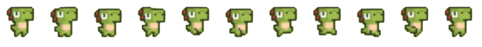

<div align="center">
  <font size="5">🐲 DINO GUN 🐉</font>
</div>

<div align="center">
* Game trial: 
    </div>

<div align="center">
* Game breakdown: 
</div>

<div align="center">
Bản Tiếng Việt: <a href="./README.md">Vietnamese version</a>
</div>

## Introduction

In a distant world, peaceful dinosaur species are threatened by a new danger. The death gate opens, releasing terrifying monsters that attack dinosaur communities. Brave dinosaur warriors have armed themselves and are ready to fight against the horde of monsters. You will play the role of a skilled commander, building and fortifying defenses, strategizing, and leading the army into battle against the dark eagle.

Join the adventure and explore the colorful world of DINO GUN now 🎮!

- [Information](#information)
- [Idea](#idea)
- [Milestone](#milestone)
- [Prerequisites](#prerequisites)
- [Download](#download)
  - [No code](#download-no-code)
  - [Include code](#download-with-code)
- [Gameplay](#gameplay)
  - [Begin](#begin)
  - [Level](#level)
  - [Object](#object)
    - [Player](#player)
    - [Threat](#threat)
  - [Play](#play)
- [Graphics](#graphics)
- [Notes](#notes)

## **Information**

Name: Lê Thị Tú Phương

Student ID: 22020695

Class: K68J

Email: 23020695@vnu.edu.vn

Facebook: https://www.facebook.com/Lethituphuong2005

## **Idea** <a name="idea"></a>

> Developed based on the game CASTLE DEFENDER: a strategic castle defense game.

## **Milestone**

### **<font color="green">March 17, 2024</font>**

- Define the concept and detailed plan for "Dino Gun".

### **<font color="green">March 19, 2024</font>**

- Search for and select suitable graphics for the game.

### **<font color="green">From March 20 to April 8, 2024</font>**

- Develop the main part of the game, including gameplay environment, levels, and special features.

### **<font color="green">From April 10 to April 24, 2024</font>**

- Polish and fine-tune game features, graphics, and gameplay of "Dino Gun".

### **<font color="green">April 25, 2024</font>**

- Completion of "Dino Gun" and ready for release!

## **Prerequisites**

> C++  
> SDL_2

## **Download**

### **No code**

Download the game (compressed into .zip) at the following link: [Game Link](https://github.com/nmhienbn/PVZ-Kaito-NMH-Edition/releases/tag/published)
This method saves a lot of memory and download time.
Unzip the game into a folder and run pvz.exe to play.

### **Include code**

Step 1: Clone this repo or choose Code -> Download Zip.


All the code is located in the src directory.
You can skip to step 5 to play directly.    
Step 2: Install Mingw. Here, I installed the MinGW-W64 GCC-8.1.0 x86_64-posix-seh version.
Some notes:

If using a different compiler, you need to recompile the icon: go to the icon directory and use the command windres main.rc -O coff main.res in the cmd.
You need to delete three C++ dlls in the directory containing pvz.exe: libgcc_s_seh-1.dll, libstdc++-6.dll, libwinpthread-1.dll. These three dlls are only for players who do not have C++ installed on their machine.
Step 3: Install GNU make

Step 4: Open cmd in the directory containing Makefile and type the make command.

Step 5: Run pvz.exe and play

## **Gameplay**

### <span style="color: green;">**Begin**</span>

When entering the game menu screen, there are moving dinosaurs, there will be 5 lines of text for you to choose, you can play the game immediately here without levels and color selection for the character, default is yellow, or go to the highscore function to see the top 5 scores for each play, the help function will guide you on how to play and the rules, in the level line when you click will change to level and mute for the character, by default. There will be the exit button to help you exit the game, the sound button will help you turn on and off the sound, just click on the icon.


### <span style="color: green;">**Level**</span>

When you switch from the menu scene to the level scene, you will be able to choose the difficulty level of the game from easy to hard.


### <span style="color: green;">**Object**</span>

#### <span style="color: orange;">**Player**</span>

After you go from level scene to choose dino color, there will be images and names below for you to choose colors for the dino you want to play


#### <span style="color: orange;">**Threat**</span>

To confront the dino and capture the tower will be the threats, threats will include objects:


### <span style="color: green;">**Play**</span>

Use the A S W D buttons to move the character, use the left mouse button to shoot bullets to damage the Threat, protect the tower. Be careful not to let the dino touch the monsters and don't shoot too many bullets, bullets are limited. When the dino or tower runs out of health, it's Game Over.

## **Graphics**

Support from theoretical teachers, practical teachers, and mentors.
Resources from lazyfoo, chat gpt, practice 123, ...





## **Notes**

Here will be the main algorithms to create the game:
-Collision between objects

```cpp
bool BaseObject::IsCollision(const BaseObject* other) const
{
    int left = other->GetRectCollision().x - (this->GetRectCollision().x + this->GetRectCollision().w);
    int top = (other->GetRectCollision().y + other->GetRectCollision().h) - this->GetRectCollision().y;
    int right = (other->GetRectCollision().x + other->GetRectCollision().w) - this->GetRectCollision().x;
    int bottom = other->GetRectCollision().y - (this->GetRectCollision().y + this->GetRectCollision().h);

    return !(left > 0 || right < 0 || top < 0 || bottom > 0);
}
```

-Move the player according to the A S W D keys

```cpp
if (keyboardState[SDL_SCANCODE_A])
{
    this->SetFlipH(true);
    vector.x = -1.f;
    isMoving = true;
}

if (keyboardState[SDL_SCANCODE_D])
{
    this->SetFlipH(false);
    vector.x = 1.f;
    isMoving = true;
}

if (keyboardState[SDL_SCANCODE_W])
{
    vector.y = -1.f;
    isMoving = true;
}

if (keyboardState[SDL_SCANCODE_S])
{
    vector.y = 1.f;
    isMoving = true;
}
```

-Algorithm for threats to spawn at random positions

```cpp
if (Random::RandomBool())
{
    this->SetOrigin({ Random::RandomInt(0, WINDOW_WIDTH), Random::RandomBool() ? 0 : WINDOW_HEIGHT });
}
else
{
    this->SetOrigin({ Random::RandomBool() ? 0 : WINDOW_WIDTH, Random::RandomInt(0, WINDOW_HEIGHT) }); //
}
```

-Algorithm for threats to always move towards the tower to attack

```cpp
if (this->m_state == ThreatState::WALK)
{
    Vector2f vec = Vector2f((float)(WINDOW_WIDTH / 2 - o.x), (float)(WINDOW_HEIGHT / 2 - o.y));

    if (vec.Magnitude() > 80.f)
    {
        this->Move(vec.Normalize() * (float)(this->m_speed * delta));
    }
    else
    {
        this->SetState(ThreatState::ATTACK);
    }
}
```

-Using the singleton pattern to ensure only one g_game is initialized

```cpp
Game* Game::GetInstance()
{
    if(g_game==nullptr)
    {
        g_game=new Game();
    }
    return g_game;
}
```

-Function to switch scenes between windows

```cpp
void Game::SetScene(BaseScene* scene)
{
    m_scene = scene;
}
```
