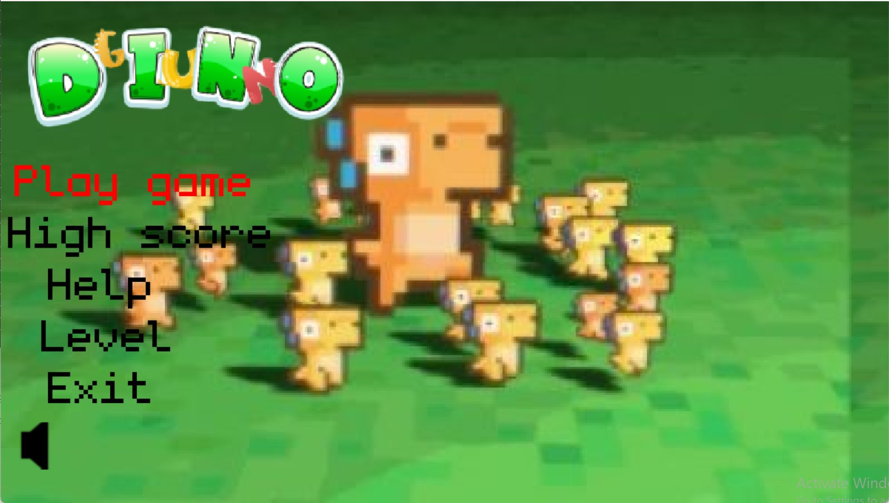
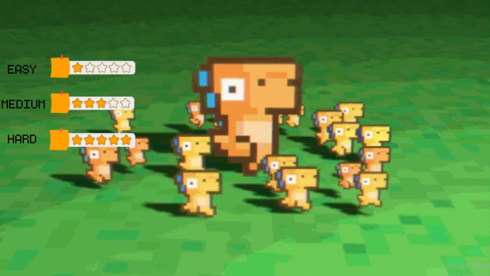
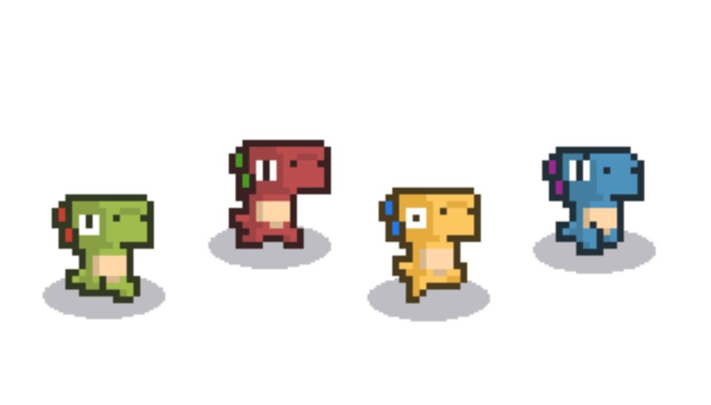
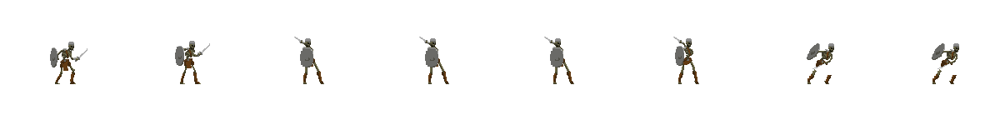
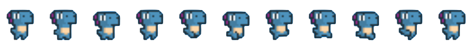
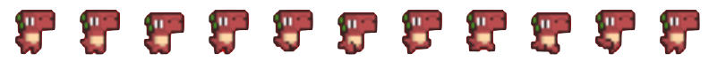
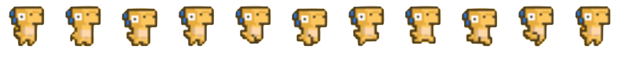
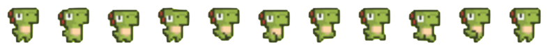

 <div align="center">
  <font size="50">🐲 DINO GUN 🐉</font>
</div>

<div align="center">
* Thử nghiệm game: 
    </div>

<div align="center">
* Phá đảo game: 
</div>

<div align="center">
Bản Tiếng Anh: <a href="./README-en.md">English version</a>
</div>

## Giới thiệu

Trong một thế giới xa xôi, các loài khủng long sống hòa bình bị đe dọa bởi một nguy hiểm mới. Cổng tử thần mở ra, phóng ra những quái vật đáng sợ, tấn công các cộng đồng khủng long.
Chiến binh khủng long dũng cảm đã đeo súng, sẵn sàng chiến đấu chống lại đại quân quái vật. Bạn sẽ đóng vai trò của một chỉ huy tài ba, xây dựng và củng cố trận địa, sắp xếp chiến lược, và dẫn dắt quân đội vào cuộc chiến chống lại đại bàng đen.

Hãy tham gia vào cuộc phiêu lưu và khám phá thế giới đầy màu sắc của DINO GUN ngay bây giờ 🎮 !

- [Information](#information)
- [Idea](#idea)
- [Milestone](#milestone)
- [Prerequisites](#prerequisites)
- [Download](#download)
  - [No code](#download-no-code)
  - [Include code](#download-with-code)
- [Gameplay](#gameplay)
  - [Begin](#begin)
  - [Level](#level)
  - [Object](#object)
    - [Player](#player)
    - [Threat](#threat)
  - [Play](#play)
- [Graphics](#graphics)
- [Notes](#notes)

## **Information**

Name: Lê Thị Tú Phương  
Student ID: 22020695  
Class: K68J  
Email: 23020695@vnu.edu.vn  
Facebook: https://www.facebook.com/Lethituphuong2005

## **Idea**

> Phát triển theo game CASTLE DEFENDER: game thủ thành chiến thuật.

## **Milestone**

### **<font color="green">Ngày 17/3/2024</font>**

- Xác định ý tưởng và lập kế hoạch chi tiết cho "Dino Gun".

### **<font color="green">Ngày 19/3/2024</font>**

- Tìm kiếm và chọn lựa đồ họa phù hợp cho trò chơi.

### **<font color="green">Từ ngày 20/3 đến ngày 8/4/2024</font>**

- Phát triển phần chính của trò chơi, bao gồm môi trường chơi, màn chơi và tính năng đặc biệt.

### **<font color="green">Từ ngày 10/4 đến ngày 24/4/2024</font>**

- Hoàn thiện và điều chỉnh tính năng, đồ họa và gameplay của "Dino Gun".

### **<font color="green">Ngày 25/4/2024</font>**

- "Dino Gun" hoàn thành và sẵn sàng ra mắt!

## **Prerequisites**

> C++  
> SDL_2

## **Download** <a name="download"></a>

### **No code** <a name="download-no-code"></a>

Tải game (được nén thành .zip) tại link sau: https://github.com/nmhienbn/PVZ-Kaito-NMH-Edition/releases/tag/published
Cách này tiết kiệm bộ nhớ và thời gian tải đi rất nhiều .
Giải nén game vào một thư mục và bật pvz.exe lên và chơi.

### **Include code**

Bước 1: Clone repo này về hoặc chọn Code -> Download Zip
Tất cả code đều nằm trong thư mục src.
Có thể nhảy đến bước 5 để chơi luôn.   
Bước 2: Cài mingw. Ở đây tôi cài đặt phiên bản MinGW-W64 GCC-8.1.0 x86_64-posix-seh.
Một số chú ý:

Nếu sử dụng trình biên dịch khác thì phải dịch lại icon: vào thư mục icon rồi dùng lệnh windres main.rc -O coff main.res trong cmd.
Phải xóa ba dll của c++ trong thư mục chứa pvz.exe: libgcc_s_seh-1.dll, libstdc++-6.dll, libwinpthread-1.dll. Ba dll này chỉ dành cho người chơi không cài sẵn c++ trong máy.
Bước 3: Cài GNU make

Bước 4: Mở cmd trong thư mục chứa Makefile và gõ lệnh make.

Bước 5: Bật pvz.exe và chơi

## **Gameplay**s

### <span style="color: green;">**Begin**</span>

Khi vào màn hình menu game, có các con dino chuyển động , sẽ có 5 dòng chữ để bạn chọn, bạn có thể chơi game ngay lập tức ở đây sẽ không có level và chọn màu cho nhân vật, mặc định là màu vàng, hoặc vào hàm highscore để xem 5 điểm số cao nhất từng chơi, hàm help sẽ hướng dẫn bạn cách chơi và luật chơi, ở dòng chữ level khi bạn nhấp vào sẽ đổi sang level và màu cho nhân vật, exit sẽ giúp bạn thoát khỏi trò chơi, nút âm thanh sẽ giúp bạn tắt bật âm thanh chỉ cần nhấn vào biểu tượng.


### <span style="color: green;">**Level**</span>

Khi bạn chuyển từ menuscene sang levelscene sẽ cho các bạn chọn mức độ của game từ dễ đến khó


### <span style="color: green;">**Object**</span> <a name="object"></a>

#### <span style="color: orange;">**Player**</span>

Sau khi bạn từ levelscene sang chọn màu dino sẽ có các hình ảnh và tên ở dưới để bạn chọn màu sắc cho con dino bạn muốn chơi


#### <span style="color: orange;">**Threat**</span>

Để đối đầu với con dino, và đánh chiếm tòa tháp sẽ là những con threat, threat sẽ gồm các đối tượng:




### <span style="color: green;">**Play**</span>

Hãy dùng các nút A S W D để di chuyển nhân vật, dùng chuột trái để bắn đạn gây sát thương cho Threat, bảo vệ tòa thành. Chú ý đừng để dino chạm vào quái vật và đừng bắn quá nhiều đạn, đạn có giới hạn. Khi dino hoặc tòa tháp hết máu thì GameOver

## **Graphics**

Sự hỗ trợ từ các thầy lý thuyết, thực hành, và các anh mentor.
Các nguồn từ lazyfoo, chat gpt,thực hành 123,...
Những tài nguyên đã sử dụng:






## **Notes**

Ở đây sẽ có những thuật toán chính để tạo nên game:
-Va chạm giữa các đối tượng

```cpp
bool BaseObject::IsCollision(const BaseObject* other) const
{
    int left = other->GetRectCollision().x - (this->GetRectCollision().x + this->GetRectCollision().w);
    int top = (other->GetRectCollision().y + other->GetRectCollision().h) - this->GetRectCollision().y;
    int right = (other->GetRectCollision().x + other->GetRectCollision().w) - this->GetRectCollision().x;
    int bottom = other->GetRectCollision().y - (this->GetRectCollision().y + this->GetRectCollision().h);

    return !(left > 0 || right < 0 || top < 0 || bottom > 0);
}
```

-Thuật toán để player di chuyển theo các nút A S W D

```cpp
if (keyboardState[SDL_SCANCODE_A])
{
    this->SetFlipH(true);
    vector.x = -1.f;
    isMoving = true;
}

if (keyboardState[SDL_SCANCODE_D])
{
    this->SetFlipH(false);
    vector.x = 1.f;
    isMoving = true;
}

if (keyboardState[SDL_SCANCODE_W])
{
    vector.y = -1.f;
    isMoving = true;
}

if (keyboardState[SDL_SCANCODE_S])
{
    vector.y = 1.f;
    isMoving = true;
}
```

-Thuật toán để threat sinh ra ở vị trí ngẫu nhiên

```cpp
if (Random::RandomBool())
{
    this->SetOrigin({ Random::RandomInt(0, WINDOW_WIDTH), Random::RandomBool() ? 0 : WINDOW_HEIGHT });
}
else
{
    this->SetOrigin({ Random::RandomBool() ? 0 : WINDOW_WIDTH, Random::RandomInt(0, WINDOW_HEIGHT) }); //
}
```

-Thuật toán để threat luôn ở đến để di chuyển đến tower để tấn công

```cpp
if (this->m_state == ThreatState::WALK)
{
    Vector2f vec = Vector2f((float)(WINDOW_WIDTH / 2 - o.x), (float)(WINDOW_HEIGHT / 2 - o.y));

    if (vec.Magnitude() > 80.f)
    {
        this->Move(vec.Normalize() * (float)(this->m_speed * delta));
    }
    else
    {
        this->SetState(ThreatState::ATTACK);
    }
}
```

-Sử dụng singleton pattern để duy nhất 1 g_game được khởi tạo

```cpp
Game* Game::GetInstance()
{
    if(g_game==nullptr)
    {
        g_game=new Game();
    }
    return g_game;
}
```

-Hàm để chuyển cảnh giữa các window

```cpp
void Game::SetScene(BaseScene* scene)
{
    m_scene = scene;
}
```
